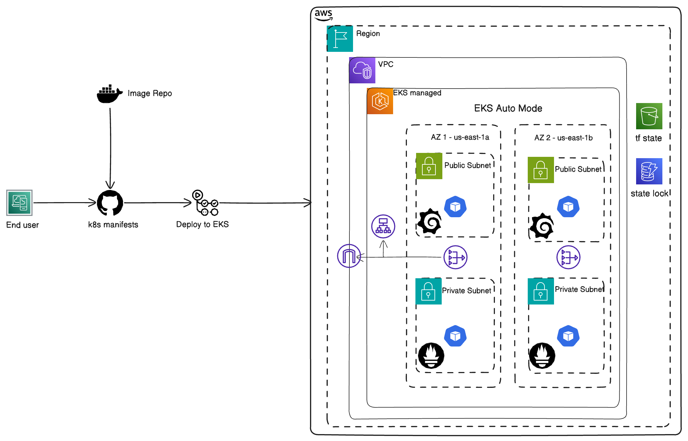
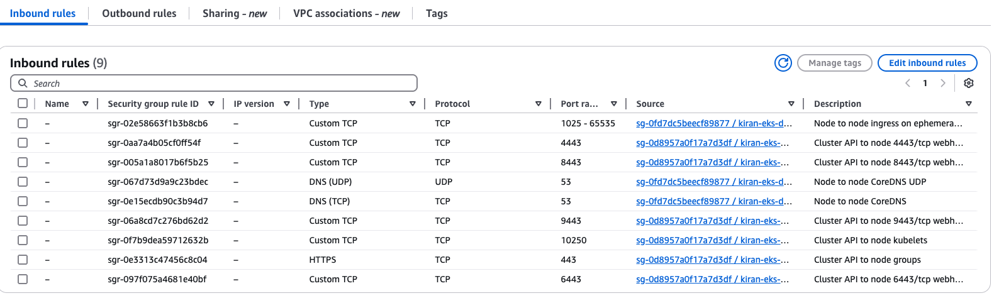
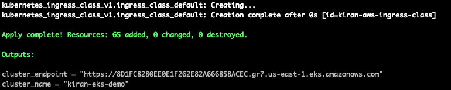
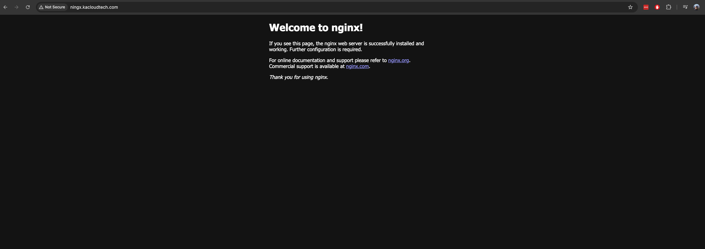
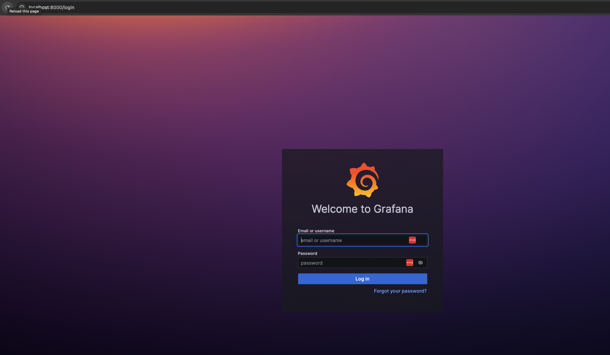

## DEPLOY NGINX APP TO AWS EKS

This document explains on how to setup and deploy an Nginx application to an AWS Elastic Kubernetes Service(EKS) cluster.

## Design Choice:

### Why AWS EKS ?
- AWS provides a managed kubernetes platform aka EKS for running and scaling kubernetes deployments.
- This deployment uses AWS EKS with Auto mode which takes of scaling cluster resources as needed based on load usage using Karpenter autoscaler. So, one less job offloaded while looking after your deployments.

### Deployment Strategy:

- Uses terraform modules EKS and VPC to provision the infrastructure needed. 
- The infrastructure has two sets of subnets:
- Highly available. Public and private subnets spread across two AZs: us-east-1a and us-east-1b.
- Public subnets for web app tiers and private subnets for any future backend requirements.
- Uses the latest available EKS version as of today: v1.32 for this setup.
- This terraform module uses two add-ons:
    -  ALB ingress controller - for loadbalancer creation purpose for application deployment.
    -  ExternalDNS - For automated creation of Route53 records based on ingress host.
    -  Prometheus and Grafana monitoring stack(Optional: can be enabled from terraform module)
- Deployment strategy to be automated using Github actions.
- To avoid complexity, this document does not cover the Github actions deployment and instead focus on deploying first using kubectl CLI.

## Seting up the cluster

### 1. Clone the repository

    $ git clone https://github.com/kirananil007/nginx-eks-automode-cluster.git
    $ cd nginx-eks-automode-cluster

### 2. Setup AWS Credentials using aws profile

    $ aws configure

### 3. Running terraform

Change the s3 bucket name and dynamoDB table as per your current account provisioned resources.

    
    terraform {
        backend "s3" {
            bucket         = "<enter_s3_bucket_name>"
            key            = "eks-dev/dev.tfstate"
            dynamodb_table = "s3-state-lock"
            region         = "us-east-1"
            encrypt        = true
        }
    }
    

* Note:
If you don't like to run each command, there is a makefile to do those tasks.

 Useful makefile commands to be run as follows:

    $ make setup        #  setup aws credentials and profile configured
    $ make init         # Initialize Terraform
    $ make plan         # See what Terraform will do
    $ make apply        # Provision infrastructure
    $ make deploy       # Deploy nginx app to EKS
    $ make get-pods     # List all running pods
    $ make port-forward # Port forward to Grafana UI
    $ make destroy      # Tear down the infrastructure

* Note: Ensure the make commands are run from the root directory.

$ cd nginx-eks-automode-cluster/

Run these terraform commands after switching to directory:

    $ cd nginx-eks-automode-cluster/terraform-eks

Terraform command line:

    $ terraform init
    $ terraform plan
    $ terraform apply

## Deploy application to cluster

To keep things simple, update the kube config and connect to the newly deployed cluster.

    $ aws eks update-kubeconfig --name <cluster_name> --region us-east-1

Deploy the kubernetes manifests to the cluster. Before applying this command, please replace the domain in k8s-manifests/ingress.yaml to your ningx.<your-domain>.com

    $ kubectl apply -f k8s-manifests/

Try accessing all the pods resources in cluster. Use the following commands and see the webapp and add-on component pods are in running state like alb and external dns.

    $ kubectl get pods -A

The ingress.yaml takes care of creating the loadbalancer and maps its with the domain name from route53.

Now after couple of minutes you should be able to access the nginx application from the host endpoint.

The cluster observability is implemented using prometheus and grafana stack. Update the terraform/values/prometheus-grafana.yaml with the respective ingress endpoint.

For testing, you may use port forward to check whether the grafana page is up and running.

    $ kubectl port-forward svc/kube-prometheus-stack-grafana 8000:80 -n monitoring

Access it in your browser using http://localhost:8000

## Areas of improvement

1. Implementing a more robust GitOps strategy using ArgoCD.

2. Replace kubernetes manifests using helm package manager.

3. Implement image scanning for any CVE in the pipelines.

4. Restrict image pulls only from private repositories and avoid using latest image tags using Open Policy Agent(OPA). 

5. Horizontal pod autoscaler(HPA)/ KEDA based on application scaling needs.

6. Ideal production scenario should be deployment across 3 Availability zones(AZ) instead of the current setup's two.

## Delete the AWS resources

To avoid incurring charges for the EKS cluster, please delete the resources created after usage.

    $ terraform destroy

## References

1. [AWS EKS modules](https://github.com/terraform-aws-modules/terraform-aws-eks)

2. [ExternalDNS helm chart](https://github.com/kubernetes-sigs/external-dns/blob/master/charts/external-dns/values.yaml)

3. [ALB ingress controller helm chart](https://github.com/kubernetes-sigs/aws-load-balancer-controller/blob/main/helm/aws-load-balancer-controller/values.yaml)